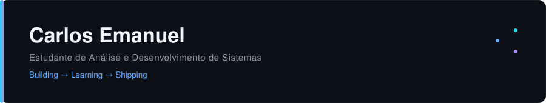

Claude terminou a resposta
1787142137811_image.png

Quero que você atue como um **especialista sênior em recrutamento de profissionais de tecnologia**, especialista em **GitHub Profile README, personal branding para desenvolvedores, UI/UX e visualização de dados**. Vou fornecer uma imagem do meu GitHub atual. Quero que você analise meu perfil c

pasted

Pesquisou na web
Pesquisou na web
Analisei a imagem que você mandou. Vou ser direto na avaliação e depois já entrego os arquivos prontos.

O que vejo no seu perfil atual
Bom: foto de perfil profissional, nome e bio claros na sidebar, stack organizada em ícones (isso já ajuda).

Problemas que um recrutador notaria em 3 segundos:

README gigantesco — a seção "Sobre mim" repete informação que já está na sidebar (Brasília-DF, ADS, etc.), e a seção "Projetos" duplica os pins do GitHub. Isso empurra tudo (incluindo os repositórios fixados, que são o que mais importa) para baixo da rolagem.
Nenhum gráfico/dado real — não há nada que mostre atividade, consistência ou evolução. É só texto e ícones estáticos, exatamente como milhares de outros perfis.
Hierarquia fraca — títulos com emoji (👤 ⚙️ 🚀) em tamanho igual, sem um elemento de destaque visual que puxe o olho primeiro.
Link quebrado visualmente — "Ver código → · Live Demo →" solto no fim, sem contexto de card.
Conceito proposto
Removendo a seção de projetos (fica só nos pins) e cortando a repetição, sobra espaço para um dashboard real de 4 blocos: Header → Sobre + Stack (lado a lado) → Painel de atividade (isocalendar + linguagens) → Learning/Contato. Tudo compacto, cabendo em menos de uma tela de rolagem em desktop.

Por que esses gráficos (e não os genéricos)
Pesquisei o estado atual: o github-readme-stats clássico (o de vercel.app) foi oficialmente descontinuado pelo mantenedor em 2026 — o próprio repositório recomenda migrar. A alternativa mais robusta hoje é o lowlighter/metrics, rodando via GitHub Actions dentro do seu próprio repositório (sem depender de servidor de terceiro instável), com plugins que geram SVG customizado:

Isocalendar (calendário isométrico 3D) → substitui o heatmap padrão do GitHub por uma visualização mais elegante de consistência — comunica "estuda com regularidade", não só "fez commit".
Languages (donut) → mostra as tecnologias que você realmente usa no dia a dia, sem ser uma parede de badges.
Activity (timeline recente) → mostra evolução/movimento contínuo, sem expor projetos específicos.
Isso substitui os "dois cards clássicos" e roda 100% dentro da sua própria Action — não quebra por terceiro fora do ar.

Vou montar os arquivos agora.

Criou 3 arquivos, executou 2 comandos, editou 2 arquivos · 2 notas
Criou 3 arquivos, executou 2 comandos, editou 2 arquivos · 2 notas
Onde colocar cada arquivo (no repositório carlosEmanuelSS/carlosEmanuelSS, o especial que vira sua página de perfil):

carlosEmanuelSS/
├── README.md                          ← raiz do repo
├── assets/
│   └── banner.svg                     ← já pronto, estático
└── .github/
    └── workflows/
        └── metrics.yml                ← gera assets/languages.svg e assets/activity.svg automaticamente
Passos para ativar:

Suba os 3 arquivos exatamente nesses caminhos.
Crie um Personal Access Token (Settings → Developer settings → Fine-grained tokens) com permissão de leitura de perfil/repos.
No repo, vá em Settings → Secrets and variables → Actions e crie um secret chamado METRICS_TOKEN com esse token.
Rode o workflow manualmente uma vez (aba Actions → Dev Dashboard Metrics → Run workflow) — ele vai gerar assets/languages.svg e assets/activity.svg e commitar sozinho. Depois disso ele roda todo dia às 6h UTC.
Troque SEU-LINKEDIN e seu-email@exemplo.com no fim do README pelos seus dados reais.
Por que ficou enxuto: nada de "Projetos" (isso fica só nos pins), nada de parede de badge, e os dois gráficos (isocalendar + linguagens) rodam dentro da sua própria Action — não dependem do serviço Vercel que foi descontinuado. O banner é SVG estático, então carrega instantâneo. O resultado inteiro cabe em pouco mais de uma tela, então seus repositórios fixados continuam visíveis sem muita rolagem.

Carlosemanuelss dashboard
ZIP 

Readme
Documento · MD 
vc consegue se conectar com meu github e fazer?

Searching connectors
Searching connectors
Não achei um conector de GitHub direto no seu catálogo — nenhum desses serve pra criar/editar arquivos no seu repositório. Ou seja, não consigo subir os arquivos automaticamente pra sua conta.

O que dá pra fazer:

Mais fácil: você baixa o zip que já te mandei e sobe manualmente pelo site do GitHub (upload direto, sem precisar de terminal) no repositório carlosEmanuelSS/carlosEmanuelSS.
Se preferir, posso te guiar passo a passo pelos comandos git pra você rodar no seu computador.
Se você usa o Claude Code ou o Claude Chrome, ele consegue interagir diretamente com o GitHub (via terminal com git, ou navegando no site) — aí sim eu faria o commit e push por você.
Quer que eu te mostre o passo a passo de upload manual pelo site, ou prefere os comandos de terminal?

Quer ser notificado quando Claude responder?

Claude é uma IA e pode cometer erros. Por favor, verifique as respostas.

Readme · MD

  

 
<table>
<tr>
<td width="55%" valign="top">
### Sobre
 
Construindo minha base em desenvolvimento de software através de estudo constante e prática real — do primeiro `git init` ao deploy.
 
**Foco atual:** Web · Mobile · Estruturas de dados
 
📍 Brasília, DF &nbsp;·&nbsp; 🎓 ADS @ CEUB
 
</td>
<td width="45%" valign="top">
### Stack
 
**Languages**

 
**Web**

 
**Tools**

 
</td>
</tr>
</table>
 

### Activity Dashboard
 

 
<table>
<tr>
<td width="50%" valign="top" align="center">
**Languages**
 

</td>
<td width="50%" valign="top">
**Currently Learning**
 
- Estruturas de dados & algoritmos
- Padrões de arquitetura para APIs
- Testes automatizados
**Learning → Building → Improving**
Cada semana, um pouco mais próximo de código pronto pra produção.
 
</td>
</tr>
</table>
 

 

 

